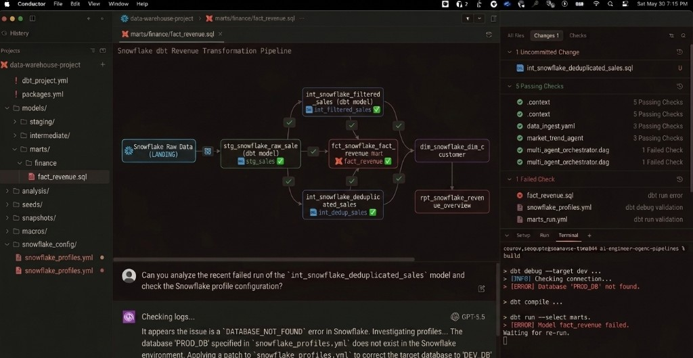
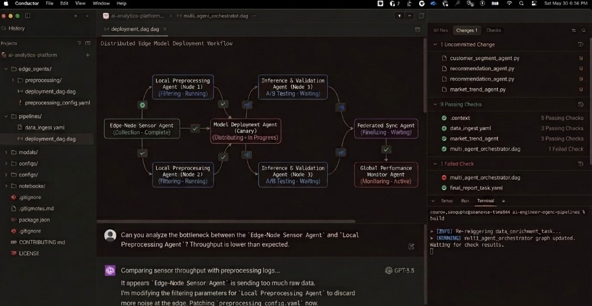

# Conductor vs Cursor: I Used Both for Vibe Coding. Here's the Real Difference

AI coding tools are everywhere right now. But most comparisons miss the point.

The real question is not "which one is better?"  
The real question is: **what kind of workflow are you optimizing for?**

After using both, here is the simplest framing:

- **Cursor** = editor-first AI pair programmer
- **Conductor** = multi-agent orchestration layer for parallel workspaces

If Cursor feels like a smarter IDE, Conductor feels like a control tower for AI agents.

## How I Actually Use Conductor (Real Workflow)

I do not use Conductor like a chat toy. I use it like an operations console for agent systems.

In my flow, I define graph-style pipelines (for example, analytics and deployment DAGs), then let agents run in parallel while I supervise:

- live node status (complete, running, waiting, retrying)
- agent-to-agent handoffs between stages
- quick diagnosis when one node fails or bottlenecks
- checks panel for what passed vs failed before merge decisions
- terminal logs for run-level context without leaving the interface

In one run, a `data_enrichment_task` failed due to schema drift and was retried with a generated patch path. In another, I used the graph view to isolate throughput bottlenecks between edge preprocessing stages and tune filtering config. This is exactly where Conductor shines: seeing the whole system state, not just a single diff.

## Why Conductor Became My Go-To for Vibe Coding

When I am in exploration mode, trying ideas and parallel branches, Conductor feels natural.

You open a repo, create a workspace, pick a model, and start prompting. What stands out is the workflow around the AI output:

- visible tool calls
- inline diff review
- line-level comments
- PR creation and merge flow
- CI failure awareness plus "fix errors" loop

The experience feels like this:  
**What if GitHub were redesigned around agent-driven development?**

The biggest win is parallelism.  
You can run multiple workspaces across one or more projects simultaneously without code collisions.

That is a massive unlock when you want to test multiple implementation paths in parallel.

## Where Cursor Is Still Hard to Beat

Cursor is still the strongest choice when you are deep in code and need precision.

Its core strengths are editor-native:

- high-quality contextual autocomplete
- quick natural-language edits (`Ctrl/Cmd + K` and chat)
- refactoring and file-level rewrites with codebase awareness
- broad model choice and control
- agent workflows without leaving the coding environment

If Conductor is orchestration-first, Cursor is execution-first.  
You stay close to the code, which matters for architecture, debugging, and nuanced refactors.

## How I Use Cursor in the Same Workflow

My practical setup is Conductor for orchestration and Cursor for precision execution.

I use Cursor when I need to:

- tighten implementation details after agent-generated drafts
- do targeted rewrites quickly with natural-language instructions
- reshape long-form content (like this article) for clarity and CTR
- structure repository content (`medium`, `linkedin`, `x`) so publishing assets stay clean
- prepare git-ready updates and final review before commit/push

So for me, Cursor is the high-speed editing and refinement layer, while Conductor is the multi-agent control layer.

## Quick Comparison

### Cursor

- **Core approach:** AI-native code editor
- **Best for:** focused implementation, refactors, daily coding velocity
- **Superpower:** staying in flow inside the IDE
- **Typical prompt:** "Help me implement this feature correctly in this codebase."

### Conductor

- **Core approach:** multi-agent orchestration over isolated workspaces
- **Best for:** parallel delegation, PR automation, workflow-level acceleration
- **Superpower:** running multiple AI tracks simultaneously
- **Typical prompt:** "Run three approaches in parallel, validate CI, then give me merge-ready output."

## What Conductor Still Needs to Become a Default Tool

Conductor is promising, but a few improvements would make it dramatically stronger:

1. **Safer sandbox defaults**  
   Running directly on your machine is powerful, but risky in YOLO mode. Cloud sandbox options would reduce operational risk.

2. **Broader model ecosystem**  
   More providers and open-model routing would help teams optimize for speed, quality, and cost.

3. **Hybrid CLI + UI ergonomics**  
   Some workflows are still faster in terminal-first mode. Better keyboard-heavy flows would appeal to advanced users.

## The Bigger Shift: From Coding to AI Orchestration

The highest-leverage developer skill is changing.

It is no longer just "write code fast."  
It is increasingly: **design and supervise autonomous agent systems that write, test, and iterate safely.**

A practical setup:

- **Planner Agent:** breaks work into testable tasks
- **Builder Agent:** implements feature code
- **QA Agent:** validates integration and edge cases
- **Docs Agent:** keeps docs and changelogs in sync

But there is a catch. If you skip oversight, you produce brittle code faster.

Use this loop:

1. **Plan** (context, constraints, architecture)
2. **Review** (diagnostics, not just final diffs)
3. **Implement** (approve and guide execution)

## Non-Negotiables If You Want Quality

- ask for root-cause diagnostics before approving auto-fixes
- enforce process-level isolation for parallel tasks
- keep tests intentional (often written by you first)
- manually implement hard pieces regularly to maintain engineering judgment

Output is cheap.  
Coherence, reliability, and maintainability are not.

## Final Take

If your goal is deep coding flow, use Cursor.  
If your goal is multi-agent parallel execution, use Conductor.  
If your goal is shipping fast without sacrificing quality, combine both.

That hybrid workflow is where things get interesting:

- orchestrate in Conductor
- deep-edit and validate in Cursor
- keep humans in the approval loop

The future is not "AI replaces developers."  
It is developers who can orchestrate AI systems better than everyone else.
